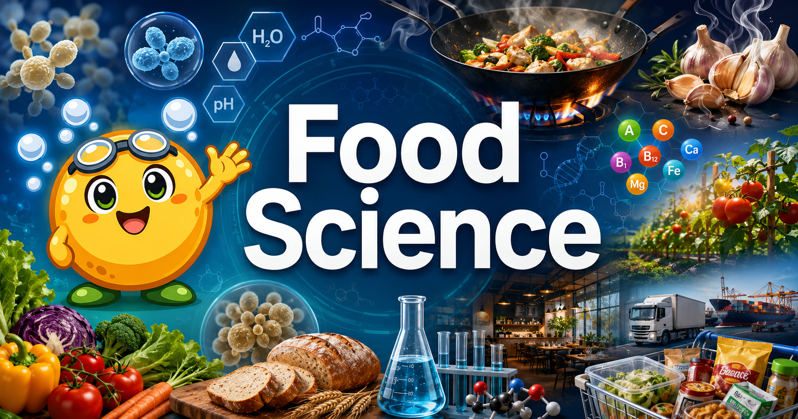

# Food Science for 9th Grade

<figure markdown>
  { width="100%" }
  <figcaption>Food Science for 9th Grade — Where Kitchen Chemistry Meets Real Life</figcaption>
</figure>

!!! mascot-welcome "Welcome, Scientists!"
    
    Science is delicious! You already have a relationship with food — you eat it every day. This course transforms that everyday experience into real science. Let's bubble up some answers together!

## What Is This Course About?

**Food Science for 9th Grade** is a year-long exploration of the chemistry, biology, physics, and engineering hiding inside every pot, pan, refrigerator, and lunchbox. Why does bread rise? Why do onions make you cry? How can bacteria both spoil food *and* save it? How does a perfectly emulsified salad dressing stay creamy? This book answers all of that — and teaches you to ask the questions yourself.

The course is built around two types of hands-on labs that alternate throughout the year:

| Lab Type | What You Do | Why It Matters |
|----------|-------------|----------------|
| **Virtual MicroSim Labs** | Adjust pH sliders, watch yeast populations grow in real time, explore the Maillard reaction step-by-step | Instant visual feedback, no cleanup required — experiment freely |
| **Kitchen Labs** | Taste, smell, measure, and observe real food undergoing real transformations | Direct sensory experience builds intuition that no textbook alone can give |

## 15 Chapters of Food Science

| # | Chapter | Big Idea |
|---|---------|----------|
| 1 | [Science in the Kitchen](chapters/01-science-in-the-kitchen/index.md) | The lab is already in your home |
| 2 | [Molecules of Food](chapters/02-molecules-of-food/index.md) | Carbs, proteins, fats — their molecular shapes explain their behavior |
| 3 | [Heat and Cooking Science](chapters/03-heat-and-cooking-science/index.md) | Maillard reaction, protein denaturation, three types of heat transfer |
| 4 | [Food Microbiology](chapters/04-food-microbiology/index.md) | The tiny organisms that spoil food — and save it |
| 5 | [Baking Science](chapters/05-baking-science/index.md) | Gluten, leavening agents, emulsification, and why fat makes cake tender |
| 6 | [Sourdough & Wild Fermentation](chapters/06-sourdough-wild-fermentation/index.md) | Grow a living starter from scratch; capture wild yeast from the air |
| 7 | [Food Safety & Sanitation](chapters/07-food-safety-sanitation/index.md) | Temperature danger zone, HACCP, and how to prevent foodborne illness |
| 8 | [Nutrition Science](chapters/08-nutrition-science/index.md) | Macronutrients, micronutrients, digestion, and reading nutrition labels |
| 9 | [Food Preservation](chapters/09-food-preservation/index.md) | Canning, pickling, freezing, drying — the science behind each method |
| 10 | [Sensory Science](chapters/10-sensory-science/index.md) | The five basic tastes, the role of smell, and how your brain builds flavor |
| 11 | [Food Technology & Processing](chapters/11-food-technology-processing/index.md) | Pasteurization, homogenization, food additives, and industrial food |
| 12 | [Agricultural Systems](chapters/12-agricultural-systems/index.md) | Farm to table, soil science, food miles, and sustainability |
| 13 | [Farm-to-Table & Local Food](chapters/13-farm-to-table-local-food/index.md) | Post-harvest physiology, food hubs, CSAs, and the ultra-processed food problem |
| 14 | [Global Food Cultures](chapters/14-global-food-cultures/index.md) | How geography, climate, and culture shape what people eat |
| 15 | [Food Engineering & Innovation](chapters/15-food-engineering-innovation/index.md) | Lab-grown meat, precision fermentation, 3D-printed food, and careers |

## Who This Book Is For

- **9th grade students** (approximately 14–15 years old) in a science or elective class
- **Curious eaters** who want to understand what is actually happening when food is cooked, preserved, or digested
- **Future scientists, engineers, and chefs** who want a rigorous foundation that connects to AP Chemistry, AP Biology, and beyond

**Prerequisites:** Middle school general science — basic atoms and molecules, basic cell biology. No cooking experience required.

## How to Use This Book

Navigate using the sidebar to the left:

- **[Chapters](chapters/index.md)** — Main educational content with embedded MicroSims and kitchen labs
- **[Learning Graph](learning-graph/index.md)** — An interactive map showing how concepts depend on each other
- **[MicroSims](sims/index.md)** — Standalone interactive simulations you can explore independently
- **[Glossary](glossary.md)** — Definitions for every key term in the course
- **[FAQ](faq.md)** — Answers to the most common student questions

Each chapter includes:

- **Key concepts** aligned to the learning graph
- **MicroSim virtual labs** embedded directly in the text
- **Kitchen lab instructions** for hands-on experiments
- **Self-assessment quizzes** to check your understanding

## Ready to Start?

Jump straight into [Chapter 1: Science in the Kitchen →](chapters/01-science-in-the-kitchen/index.md)
